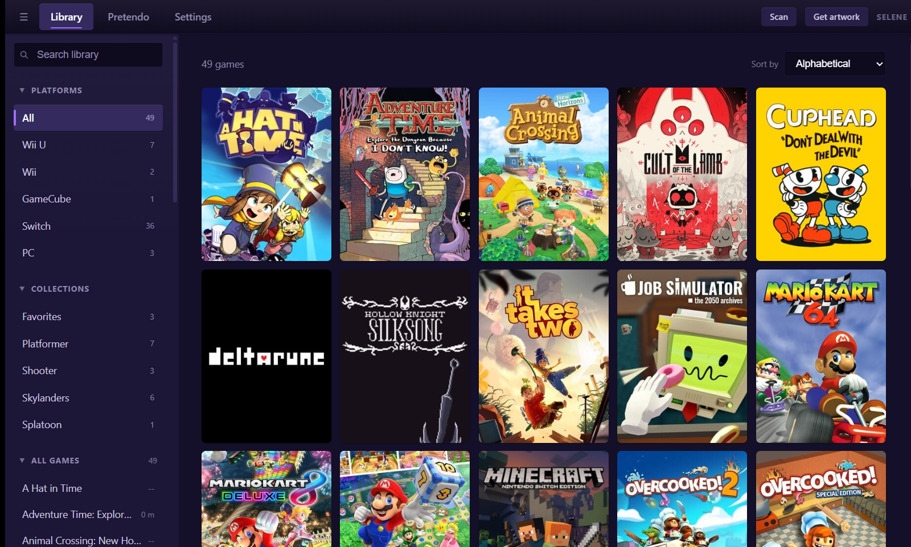

# Selene

A local-first desktop game launcher that looks and behaves like the Steam
client, and acts as **one unified library** across multiple emulators *and*
installed PC games — with per-emulator and per-game configuration that hooks
each emulator's own settings instead of fighting them.

No account. No server. No telemetry. Everything is stored on your machine.



---

## What it does

- **One library, many sources.** GameCube, Wii, Wii U, Switch and PC titles in a
  single grid, with search, sort, filter, favourites and your own tags &
  collections.
- **Automatic artwork.** Cover and hero art from IGDB, matched by title ID where
  possible (far more reliable than fuzzy filename search), with a manual
  override for anything it can't supply.
- **Per-game configuration that respects the emulator.** Overrides are written
  into each emulator's *own* per-game mechanism, so your global config is never
  clobbered and the settings also apply when you launch the emulator directly.
- **Steam-like behaviours.** Accurate playtime (tracks the whole process tree,
  so it's right even for games that fork and exit their launcher), a system tray
  with a "now playing" state, and minimise-while-playing.
- **Controller navigation.** Drive the whole UI with a gamepad — spatial focus
  movement, A to activate, B to go back, bumpers to switch tabs.
- **First-class theming.** Two dark themes, a light theme, and drop-in
  user themes: one CSS file of design tokens, no code.

## Supported emulators & formats

| Emulator | Platform | Scanned formats |
|---|---|---|
| **Dolphin** | GameCube / Wii | `.iso` `.rvz` `.wbfs` `.gcm` `.ciso` `.nkit` |
| **Cemu** | Wii U | `.wua` `.wud` `.wux` `.rpx`, and extracted `code/content/meta` folders |
| **Eden** | Switch | `.nsp` `.xci` (and `.nsz` via built-in conversion) |
| *(direct)* | PC (Windows) | a game folder — the launch `.exe` is auto-detected |

Per-game config maps to each emulator's native mechanism:

- **Dolphin** — `GameSettings/<GameID>.ini`
- **Cemu** — `gameProfiles/<TitleID>.ini`, plus graphic packs for resolution
- **Eden** — `config/custom/<TitleID>.ini` with yuzu's `use_global` inheritance

Existing per-game files are **merged, not rewritten** — a hand-set controller
binding or a value the emulator wrote itself is preserved.

## Extra tooling for Switch

- **`.nsz` conversion.** Eden doesn't read compressed `.nsz` files; the launcher
  decompresses them losslessly to `.nsp` via the [`nsz`](https://github.com/nicoboss/nsz)
  CLI (`pip install nsz`), using your own keys. Originals are kept.
- **Updates & DLC.** Matches add-ons in a separate `updates` folder to their base
  game, converts the compressed ones, and points you at Eden's *Install Files to
  NAND* (which is GUI-only — the launcher automates the conversion, not the
  install).
- **Pretendo (Wii U online via Cemu).** Configures Cemu's built-in support:
  verifies the online files you dumped from your own console are installed,
  manages your PNID, and toggles the network service — with clear warnings.

## What it does *not* do

This app bundles and downloads **no games, keys, firmware, or emulator
binaries** — you supply your own. It does not import from or touch your Steam
library, and there's no store, purchasing, achievements, friends, or cloud
saves. You point it at emulator executables and game folders you already have.

---

## Requirements

- **Windows 10/11** (primary) or **Linux**. PC games are Windows-only — the
  Linux build shows emulated titles only (no Wine/Proton layer).
- The emulator binaries you want to use (Dolphin, Cemu, Eden), wherever you keep
  them.
- **For artwork:** a Twitch developer application (free) — its Client ID and
  Secret authorise IGDB. Paste them in Settings.
- **For Switch:** your own `prod.keys` (games run on keys alone); firmware is
  optional and only needed for system applets and amiibo.
- **For `.nsz` conversion (optional):** `pip install nsz`.

## Build & run

Prerequisites: a [Rust toolchain](https://rustup.rs/), [Node.js](https://nodejs.org/)
with [pnpm](https://pnpm.io/), and the
[Tauri v2 system dependencies](https://tauri.app/start/prerequisites/) for your
OS (on Windows, the MSVC build tools and WebView2 — usually already present).

```sh
pnpm install
pnpm tauri dev      # run in development with hot reload
pnpm tauri build    # produce a standalone app + installer
```

Release output lands in `src-tauri/target/release/` (installer under `bundle/`).

> **exFAT note.** If the project lives on an exFAT drive, pnpm needs hoisted
> linking (already pinned in `pnpm-workspace.yaml`) because exFAT has no
> symlinks, and Rust's incremental cache falls back to slower file copies.
> Pointing `CARGO_TARGET_DIR` at an NTFS/ext4 path speeds up rebuilds.

## Where your data lives

Everything is under the OS config directory — `%APPDATA%\Selene` on Windows,
`~/.config/Selene` on Linux — never in the project tree:

- `library.db` — the SQLite library (games, playtime, tags, config overrides)
- `credentials.json` — your IGDB credentials
- `themes/*.css` — drop-in user themes

## Stack & architecture

Tauri v2 (Rust core) + React + TypeScript, with plain CSS custom properties so a
theme is genuinely one file. SQLite via `rusqlite`. Rust was chosen for the two
hardest parts — process-tree playtime tracking (Windows Job Objects) and fast
scanning of multi-GB ROM directories.

The core abstraction is a `Runner` trait: every way to start a game — each
emulator, and direct PC launch — implements it, which is what makes the library
genuinely unified rather than several parallel code paths. See
[ARCHITECTURE.md](ARCHITECTURE.md) for the full design and the many
format/edge-case notes learned from real dumps.

`cargo test` runs the portable unit suite (~150 tests covering title-ID parsing,
config merging, the metadata matcher, disc-header probing, and more).

## Roadmap

Not yet implemented:

- **Goldberg / Steam API emulation** — offline & LAN play for abandonware PC
  games that gate on Steamworks (detect the Steam API DLL, generate the emu
  config, manage ColdClientLoader). Scaffolding exists; the integration does not.
- **Big-picture / controller-first fullscreen mode** — controller *navigation*
  is done; a dedicated couch UI is not.

## Licence

[GPL-3.0](LICENSE). You're free to use, modify and redistribute Selene, but
derivative works must remain open-source under the same licence.

## Acknowledgements

Built to sit alongside the [Dolphin](https://dolphin-emu.org/),
[Cemu](https://cemu.info/) and Eden emulators, with metadata from
[IGDB](https://www.igdb.com/), decompression by
[nsz](https://github.com/nicoboss/nsz), and Wii U online via
[Pretendo](https://pretendo.network/). This project is an independent launcher
and is not affiliated with any of them.
